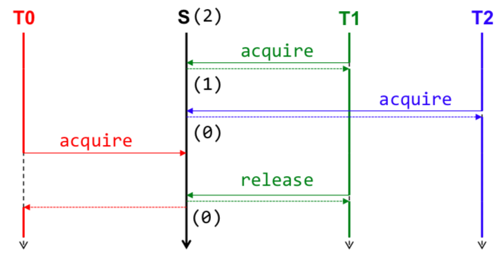
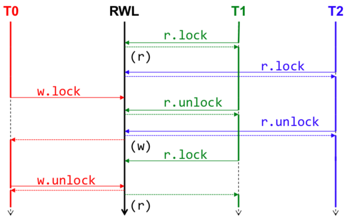
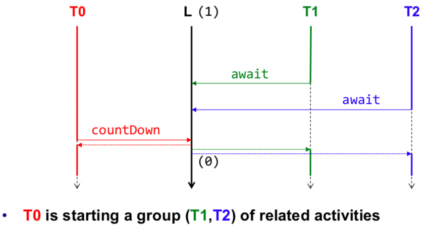
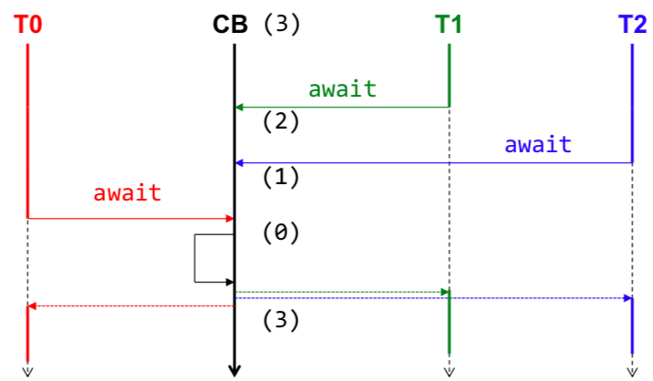
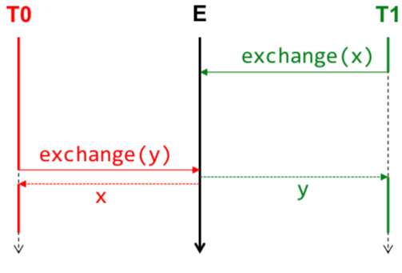
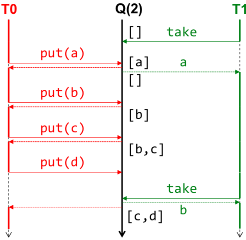

# CONPR Summary
Persönliche Zusammenfassung im Modul conpr HS18. Irrtum vorbehalten.

## Einführung

### Amdahl's Law

Die Beschleunigung einer Arbeit, mittels mehreren Kernen (Parallelisierung), kann wie folgt berechnet werden.   

**p** *= Paralell-Anteil* &nbsp;&nbsp; **s** *= Anzahl Prozessoren*  


### Concurrent vs Parallel

Geteilte Arbeit kann grundsätzlich auf zwei Arten von Arbeitern (Threads) ausgeführt werden, concurrent (gleichzeitig) oder paralell.

**Concurrent Program**

- kontrolliert mehrere logische Threads
- viele Dinge gleichzeitig handhaben
- behandeln von Ereignissen die gleichzeitig auftreten können
- Verhalten oft nicht deterministisch

**Paralell Program**  

- verschiedene Arbeiten werden wirklich paralell ausgeführt
- viele Dinge gleichzeitig ausführen
- Problem muss in Teilstücke gebrochen werden
- Verhalten deterministisch

### Risiken und Probleme

- Sicherheit
	- Schlimmes passiert nie (beim Testen)
	- Race Conditions
- Lebendigkeit
	- Gutes passiert eventuell (nicht deterministisch)
	- Deadlock, Livelock, Starvation
- Performance
	- Zu viel Synchronisierung (Amdahl's Law)
	- Context-Switches sind teuer
- Testing
	- Tests sind nicht verlässlich
	- Scheduling ist nicht deterministisch
- Debugging
	- Ist oft unmöglich
	- Heisenbugs (Bug verschwindet wenn man ihn beobachten will)

## Threads

### Prozesse und Threads

- **Ein Prozess ist ein ausführbares Programm im Speicher**
	- isolierter Speicherraum alloziert vom OS
	- Prozesswechsel (Context-Switch) sind sehr teuer
	- Kommunikation via OS (Inter-Prozess-Kommunikation)
	- Kann mehrere Threads beinhalten

- **Ein Thread ist ein gekapselter sequentieller Ablauf**
	- lebt im Adressraum des (Eltern)-Prozesses
	- hat eigenen Ausführungs-Kontext
	- kommuniziert mit anderen Threads über Shared-Memory


### Threading Modes

- Kernel-Level
	- Scheduler des Kernels kontrolliert Threads
	- Kernel bestimmt wann ein Thread CPU-Zeit hat
	- Von den meisten JVM Implementationen genutzt

- User-Level
	- Threads werden von einer Library verwaltet
	- Effiziente Context-Switches (keine Kernel Privilegien)
	- Scheduling durch Applikation supportet
	- Verschiedene Threads laufen nicht auf unterschiedlichen Prozessoren

- Hybrid-Threads
	- Mehrere User-Level-Threads werden weniger Kernel-Level Threads zugewiesen

### Java Threads

Ein Thread besteht aus einer Arbeiter (Thread) und Arbeit (Runnable). Folgend wie ein Thread erstellt werden kann:

```java
// Definition der Arbeit
public class Work implements Runnable { 
	private int nr;

	public R(int nr) { 
		this.nr = nr; 
	} 
	
	@Override
	public void run() {
		for(int i = 0; i < 10; i++) {
			System.out.println(
			"Hello" + nr + " " + i);
		}
	}
}

// Instanzierung der Arbeit
Work w = new Work(100);

// Instanzierung eines Arbeites mit Arbeit als Argument
Thread t1 = new Thread(w);

// Starten des Threads, returnt unverzüglich
t1.start();

// ALTERNATIVE IMPLEMENTATION
// Die Klasse Thread implementiert das Interface Runnable, 
// somit kann von der Klasse Thread geerbt sowie run() überschrieben werden.

// LAMDA EXPRESSION
// Da Runnable ein functional interface ist kann run() mittels LAMDA definiert werden
Thread lamda = new Thread(() -> {
	System.out.println("Ich bin der wohl sinnloseste Thread aller Zeiten.");
});

Thread methodSignature = new Thread(() -> doWork("paramA", 100));
public void doWork(String param, int magicNumber) { ... }
``` 

#### Thread API

**start()**  
- Startet den Thread

**run()**  
- Jener Code der die Arbeit representiert

**sleep(long millis [, int nanos])**  
- legt den Thread für m Millisekunden schlafen

**yield()**  
- signalisiert dem Scheduler, dass der Thread bereit ist CPU-Zeit abzugeben (Scheduler kann das ignorieren)

**join([long milliseconds])**  
- Wartet auf den Prozess (Time-Out in Millisekunden)

**setDeamon(boolean)**  
- Markiert den Thread als Deamon (blockieren JVM nicht, wenn nur noch Deamons -> JVM beendet)

**Thread.getCurrentThread()**
- Gibt aktuellen Thread zurück

**long getId()**  
- Gibt die ID eines Threads zurück

**String getName()**  
- Gibt den Namen eines Threads zurück

**boolean isDeamon()**  
- Teilt mit ob Thread ein Deamon ist oder nicht

**State getState()**  
- Gibt den Status des Threads zurück

**boolean isAlive()**  
- Gibt an ob der Thread noch läuft

#### Uncaught Exceptions

```java
interface UncaughtExceptionHandler {
	void uncaughtException(Thread t, Throwable e);
}

// instance
t1.setUncaughtExceptionHandler(...);

// static
Thread.setDefaultUncaughtExceptionHandler(...);
```

## Locks

### Race Conditions

Bearbeiten mehrere Threads gleichzeitig ein und dieselbe Ressource, wie z.B. einen Counter (Integer), so kann dies zu inkonsistenten Zuständen führen - dies bezeichnet man als Race Conditions. Klassisches Beispiel ist die Bank, wobei gleichzeitig ein Thread eine Einzahlung und ein anderer eine Abhebung durchführt. Beide werden den Kontostand (Integer/Float) aktualisieren. Wird dieser von einem Thread gelesen, kann der Kontostand in der Zwischenzeit jedoch schon wieder geändert haben, wodurch die Aktion zum falschen Kontostand führen kann (Lost-Update). Die bearbeitete Ressource ist also nicht Thread-Safe, nicht dagegen geschützt.

### Synchronization

Um Race Condtions auf **shared, mutable state** zu verhindern kann Synchronization verwendet werden.

**state**: Daten im Heap, instance und static fields  
**mutable**: Variable kann in ihrem "Leben" ändern  
**shared**: Variable kann von mehrern Threads verwendet werden

### Synchronization mit Java Features

Mit dem Keyword **synchronized** wird in Java auf einem Objekt ein Lock erstellt, also ```lock.lock()``` ausgegührt. Der Lock wird beim Eintreten (**monitorenter**) in den synchronized Block vergeben. Wenn Lock vergeben ist kommt ein Thread in eine Warteschlange. Der Lock wird freigegeben sobald der synchronized Block verlassen wird (**monitorexit**), dies auch bei einer Exception.

```java
int i = 0;
public void threadSafe() {
	synchronized (this) { // monitorenter
		i++; // atomic here!
	} // monitorexit
} 

// Kurzformen
public synchronized void threadSafe() {...} // equal to synchronized(this)
public static synchronized void doSomeSpookyStuff() {...} // equal to synchronized(Ghost.class)
```

### Reentrancy of Synchronized

Ein synchronized Block in Java ist immer **reentrant**, was bedeutet, dass ein Thread welcher einen Lock hält jeden Lock öffnen kann welcher mit dem selben Objekt synchronisiert wurde.

```java
synchronized(x) {
   synchronized(x) { /* no deadlock */ }
}

synchronized f() { g(); }
synchronized g() { /* no deadlock */ }
```

### Atomarität

- **Synchronized Blocks auf dem gleichen Lock**
	- werden atomar ausgeführt

- **Synchronized Blocks auf verschiedenen Locks**
	- werden nicht atomar ausgeführt, Interleavings also möglich

### Design von Locks

- ```synchronized(this)```
	- Implementationsdetails einsehbar
	- Macht Code angreifbar

- ```synchronized(lock)```
	- lock object kann private sein
	- explizit
	- oft zu bevorzugen

### Synchronization mit Locks

```java.util.concurrent.locks.Lock``` bietet mehr Flexibilität im Umgang mit Locks als dies ```synchronized``` tut.

- Fairness
- Non-blocking locking Strukturen
- Thread kann lock zeitlich abgestimmt erhalten
- Thread kann prüfen ob Lock verfügbar ist und in dann entgegennehmen

```java
public interface Lock {
   void lock();
   void unlock();
	boolean tryLock();
	boolean tryLock(long timeout, TimeUnit unit)
}

final Lock lock = ...;
...
lock.lock();
try {
   // access resources protected by this lock
}
finally {
   lock.unlock();
}
```

#### ReentrantLock

- ```lock``` returnt sofort wenn Thread lock bereits hält
- Weitere Methoden auf einem ReentrantLock
	- ```Thread getOwner()``` Gibt den Thread zurück der den Lock aktuell hält
	- ```boolean isHeldByCurrentThread()``` Ob der Lock durch den aktuellen Thread gehalten wird
	- ```int getHoldCount()``` Locks die der Thread auf diesem Lock hält
	- ```int getQueueLentgh()``` Threads die warten
- **Lock muss immer durch jenen Thread freigegeben werden der ihn auch erhalten hat**

### Deadlocks

Unter den folgenden Umständen können Deadlocks auftreten. Zur Verhinderung mind. eine Bedingung verhindern.

- **Mutal Exclusion** (Mutex=synchronized)
	- Zugriff auf Resource ist exklusiv
- **Hold and Wait**
	- Threads verlangen nach weitern Ressourcen wenn Sie schon welche halten
- **No Preemption**
	- Resourcen werden nur von Threads freigegeben
- **Circular Wait**
	- Zwei oder mehr Prozesse/Threads formen einen Kreis, wo jeder auf Resourcen wartet die druch den nächsten gehalten wird.

## Condition Synchronization

Möchten mehrere Threads auf eine Ressource zugreifen, welche an eine Bedingung geknüpft ist, können Probleme auftreten:

- Deadlocks  
- Inkonsistente Zustände
- Warten nicht möglich
- Unnötiges Warten bzw. Try & Wait & Try & Wait ...

### Pattern für Condition Synchronization

```java
public class CarPark extends Thread {
	
	// condition variable
	private int places;
	
	// constructor
	public CarPark(int initialPlaces) { this.places = initialPlaces; }

	// lock object
	private final Object LOCK = new Object();

	public enter() {
		synchronized(LOCK) {
			while(places == 0) { // full, so wait!
				try { lock.wait() } // leaves critical section (sleep), lock is released! 
				catch (InterruptedException e) { // NOP }
			}
			places--; // actual parking goes here
		}		
	}
	
	public synchronized leave() {
		synchronized(LOCK) {
         places++; 
         lock.notifyAll();
		}
	}

}
```

### Uniform Waiters

Werden mehrere Bedingungen eingesetzt, so würden beim verwenden des selben Locks alle auf die gleiche Bedingung warten. Grade wenn nur ```lock.notify()``` verwendet würde, könnte dies theoretisch dazu führen, dass ein Deadlock entsteht (immer selber Thread der aufgeweckt wird und die Condition nicht ändern kann/will). Lösung: Für jede Bedingung ein eigenes Condition-Objekt verwenden.

```java
public class Queue {
	private final static int SIZE = 10;
	
	private final Object[] buf = new Object[SIZE];
	private int tail = 0, head = 0;
	
	private final Lock lock = new ReentrantLock();
	private final Condition notEmpty = lock.newCondition(); 
	
	private final Condition notFull = lock.newCondition();

	public Object dequeue() { lock.lock();
		try {
          while (tail == head) { // while empty
				try { notEmpty.await(); 
			} catch (Exception e) {} }
          
          Object e = buf[head]; 
          head = (head + 1) % SIZE;
			notFull.signal(); 
			return e; 
		} finally { 
			lock.unlock(); 
		}
	}
	
	public void enqueue(Object c) { lock.lock();
		try {
    		while ((tail + 1) % SIZE == head) {
				try { notFull.await(); } catch (Exception e) {} 
			}
    
    		buf[tail] = c; tail = (tail + 1) % SIZE;
			notEmpty.signal(); 
		} 
		finally {
			lock.unlock(); 
		}
	}
}
```

### Stopping Threads

Blockierende oder sehr lange dauernde Operationen können dazu führen, dass die Anwendung pontentiell nie fertig wird da sie für immer wartet. Blockierende und lang dauernde Operationen müssen daher *cancelable* sein.

**Cancel Operations** *(auf Thread Object)*

- ```stop()``` ***DEPRECATED*** Freigeben aller Monitors, Inconsitenz wird sichtbar für andere Threads
- ```interrupt()``` 
	- Setzt das interrupt Flag
	- Bei wait / sleep / join wird eine ```InterruptedException``` geworfen
	- Lesen des Flags mit ```isInterrupted()```

	
**Handling InterruptedException**

```
try { ... }
catch (InterruptedException ie) {
	// Possible actions:
	
	// 1) Ignore exception
	// wenn angenommen wird, dass interrupt nie aufgerufen wird
	// wenn der Thread nicht interrupted werden sollte
	
	// 2) Propagate the exception
	// aufräumen der bishereigen Arbeit
	// rethrow der Exception
	
	// 3) Defer the exception
	// Exception wird am falschen Ort gefangen (z.B. im Runnable)
	// An richtigen Ort leiten, z.B. Thread.currentThread().interrupt();
}
```

## Java Memory Model

Alle Threads des selben Prozesses teilen gemeinsam den gleichen Hauptspeicher. Jedem Thread steht ein Arbeitsbereich zur Verfügung. In der Realität werden auf der CPU aber Caching-Levels angeboten und verwendet (Performance). Dies führt dazu, dass nicht alle Zustände immer im Speicher verfügbar sind, bzw. diese nicht immer durch alle Threads gelesen werden können. Das Java Memory Model definiert Garantien unter welchen Umständen Schreibvorgänge in Variabeln in anderen Threads sichtbar werden. 

### Happens Before Relation

Die Happens-Before-Relation ist eine Regel, welche Sichtbarkeiten nach **Aktionen** (*variable read/write, monitor lock/unlock, thread start/join*) in der JVM/JMM definiert und garantiert.

#### Regeln

1. Jede Aktion in einem Thread ***happens before*** jeder Aktion die später im Programmablauf ausgeführt werden.
2. Ein ```unlock``` auf einem ```monitor lock``` ***happens before*** allen nachfolgenden ```locks``` auf dem selben ```monitor lock```.
3. Ein Schreiben auf eine ```volatile``` Variable ***happens before*** allen nachfolgenden Lesezugriffen auf die selbe Variable.
4. Der Aufruf ```Thread.start()``` ***happens before*** jeder nachfolgenden Aktion in dem gestarteten Thread.
5. Aktionen in einem Thread t1 ***happens before*** ein anderer Thread die Terminierung von t1 feststellt.
6. Die ***happens before*** Reihenfolge ist transitiv (A -hb-> B && B -hb-> C => A -hb-> C)

#### Volatile

Variabeln welche mit dem Keyword ```volatile``` markiert werden dürfen nicht im local Cache gespeichert werden. Zudem werden alle Read/Write Aktionen auf die als ```volatile``` markierte Variable atomar ausgeführt. ```Synchronized``` ist also nicht nötig.

**Regeln für das Verwenden von ```volatile```**

1. Der neue Wert muss unabhängig vom alten sein, ansosten ```synchronized```
2. Der neue Wert muss unabhängig von anderen Werten sein, ansonsten ```synchronized```

### Double Checked Locking Problem

Das oben genannte Problem tritt bei der Implementierung von Singletons auf. Erst wird geprüft, ob das statische Feld ```null``` ist - falls ja, muss vor Initialiserung der Lock auf die Klasse geholt werden. Nach erhalt des Locks könnte die Instanz bereits erstellt sein, ein erneutes Prüfen auf ```null```ist also notwenig. Sie folgender Code:

```java
public class Singleton {
	private static Singleton instance;

	public static Singleton getInstance() {
		if (instance == null) {
			synchronized (Singleton.class) {
				if (instance == null) {
					instance = new Singleton();
				}
			}
		}
		return instance;
	}

	private Singleton() {
		/* initialization */ 
	}
	
	// other methods
}
```

**Lösung**

```java
public class Singleton {
	private volatile static Singleton instance;

	public static Singleton getInstance() {
		if (instance == null) {
			synchronized (Singleton.class) {
				if (instance == null) {
					instance = new Singleton();
				}
			}
		}
		return instance;
	}

	private Singleton() {
		/* initialization */ 
	}
	// other methods
}
```

## Safe Object Sharing

Wenn mehrere Threads die selbe ***mutable state variable*** teilen ohne angemessene Synchronisierung ist die Anwendung fehlerhaft. Es gibt drei Wege dies zu beheben:

1. Synchronisierung bei Verwendung der Variable nutzen
2. State Variable **immutable** machen 
3. State Variable nicht über mehrere Threads teilen

### Code Sample: Uninitialized Object

```java
final class Account {
	private int balance;
	public Account(int balance) { this.balance = balance; } 
	public String toString() { return "" + balance; }
}

class Company {
	private Account account = null;
	public Account getAccount() {
	if(account == null) account = new Account(10000);
	      return account;
   }
}

// Thread initialisiert Account
// T1 -> company.getAccount().toString();

// Thread sieht Änderung an Account nicht, L1/2 CPU Cache
// Selbst wenn, Visibilität von balance ist nicht garantiert!
// T2 -> company.getAccount().toString();
```

**Fix für obiges Beispiel**

```java
// Caching des Accounts verbieten
private volatile Account account = null;

// Visibilität von balance garantieren
private final int balance;
```

### JMM Garantien

- Final fields (Primitive- sowie Referenz- Typen) sind sichtbar **nach** Initialisierung
	-	Referenz Typen müssen über die ```final``` Referenz genutzt

Final fields werden also nach Durchlaufen des Konstruktors in den Hauptspeicher geschrieben. Dies geschieht bevor die Adresse des Objekts sichtbar wird. Initialisierungs-Garantie gilt nur wenn das Objekt erst nach Erstellung benutzt wird, ```this``` während Kontruktor also nicht im Zusammenhang mit dem State verwenden.

**Listener GOOD**

```java
public class ThisNotEscape {
	public final int i;
	
	private ThisNotEscape() {
		// DO NOT REGISTER LISTENER ON THIS WHILE CONSTRUCTING 
		i = 42; 
	}
	
	// SAFE LISTENER REGISTRATION
	public static ThisNotEscape create(Button source) { 
		final ThisNotEscape notEscape = new ThisNotEscape(); 	
		source.registerListener(new ClickListener() {
			public void buttonClicked() { 
				notEscape.doSomething();
			} 
		});
	
		return notEscape; 
	}
	... 
}
```

### Final vs Volatile

**final**

- Nur final Felder werden nach Konstruktor in RAM geschrieben
- Nur der Erste Zugriff führt zu einem Refresh
- Danach wird kein Refresh mehr ausgeführt
- **Änderungen in Referenztyp werden nicht sichtbar**

**volatile**

- Jeder Lesezugriff garantiert die neusten Daten zu sehen
- Keine Garantien für Änderungen im Referenztyp
- **Kein MUTEX, lediglich visibilität (r/w atomar)!**

### Immutablility

Finale Felder müssen richtig konstruiert werden, kein Escaping von ```this```. Felder können nach Initialisierung nicht geändert werden. **Sind immer THREAD-SAFE!**

**Strict Immutable**

- Alle Felder sind final (empfohlen)
- Cann in jede Richtung publiziert werden (visibility = consistency)

**Effectively Immutable**

- State ändert nicht, jedoch nicht ```final```
- Muss sicher publiziert werden => ```volatile```

**Wie man Objekte sichtbar macht**

- Referenz in einer ```volatile```Variable speichern
- Referenz in ein Feld speichern dass durch einen Lock geschützt ist.
- Objekt mit einem ```static``` Initialisierer erstellen
- Referenz in einem ```final``` Feld speichern und richtig konstruieren.

### Method Local Variables

Variabeln welche nicht zwischen Threads **shared** sind können nur durch den ausführenden Thread verwendet werden. Solche Variabeln sollen dann aber auch nicht publiziert werden!

**Schlecht:**

```java
public class BadFormatter {
	// variable wird publiziert (HEAP) obwohl nicht nötig!
	private static final SimpleDateFormat f = new SimpleDateFormat();
	public static String format(Date d) { 
		return f.format(d);
	} 
}
```

**Besser**

Falls das wirklich ein Perfomance Problem wäre, ```ThreadLocal``` benutzen.

```java
public class GoodFormatter {
	public static String format(Date d) {
		SimpleDateFormat sdf = new SimpleDateFormat();
		return sdf.format(d); 
	}
}
```

### ThreadLocal

Mit einer ```ThreadLocal``` Variable kann für jeden Thread eine seperate Kopie dieser Variable zur Verfügung gestellt werden. Typischerweise ```private static``` fields.

**Interface**

```java
class ThreadLocal<T> { 
	public T get();	// returns thread local value
	public void set(T value);	// sets value for current thread
	protected T initialValue(); // defines initial value
	public void remove();
}

// sample usage
private static ThreadLocal<SimpleDateFormat> local = 
ThreadLocal.withInitial(() -> new SimpleDateFormat());

public static String format(Date d) { 
	return local.get().format(d);
}

// Anwendungsbeispiel
java.util.ThreadLocalRandom
Schlechte Performance ohne ThreadLocal
```

## Lock Free Programming

Synchronisierung, also das Verwenden von Locks (```synchronized``` sowie ```java.util.concurrent.locks.Lock```), ist teuer. Threads die auf einen Lock warten können nichts anderes mehr erledigen. Schlussendlich Deadlock, Live Lock..

### CAS (Compare and Set/Swap Instruction)
Ähnlich wie ```volatile``` atomares Lesen/Schreiben garantiert, ermöglich CAS das atomare setzten von Werten. CAS vergleicht jedoch ob der alte Wert noch dem aktuellen entspricht, falls ja wird dieser durch den neuen Wert ersetzt. Diese **check than act** Instruktion wird bei CAS garantiert atomar ausgeführt. Ebenso gibt CAS den Status zurück ob das Update funktioniert hat oder nicht.

```java
long value;
boolean compareAndSet(long oldValue, long newValue) {
	// atomic check then act here!
	if(value == oldValue) { value = newValue; return true;}
	else return false;
}
```

**Semantik**

```java
public final class CASCounter {
	private volatile long value = 0;
	
	public long getValue() {
	      return value;
	}
	
   public long increment() {
      while(true) {
			long current = getValue();
			long next = current + 1;
			
			// neu setzten solange versuchen bis es klappt
			if (compareAndSwap(current, next)) 
				return next;
		}
	}
... 
}
```

***Low Level Code - UNSAFE***

```java
	public final class CASCounter { 
	...
	private static final Unsafe unsafe = Unsafe.getUnsafe(); 
	private static final long valueOffset;
	
	static { 
		try {
		valueOffset = unsafe.objectFieldOffset( 
			CASCounter.class.getDeclaredField("value")
		);
		} catch (Exception ex) { 
			throw new Error(ex); 
		} 
	}
	
	private boolean compareAndSwap(long expectedVal, long newVal){ 
		return unsafe.compareAndSwapLong(
			this, valueOffset, expectedVal, newVal
		);
	} 
}
```

### Atomics

Atomic-Datentypen unterstützen in Java alle CAS Operationen.

**Scalare**  
Visibilität gleich wie ```volatile``` => gleiche happens before Regeln

-  AtomicInteger
-  AtomicLong
-  AtomicReference\<T>  
```new AtomicReference<Pair>(new Pair(0,0));```  

-  AtomicBoolean

**Arrays**  
Bietet ```volatile``` Zugriff-Semantik auf Elemente des Arrays

- AtomicIntegerArray  
```array.compareAndSet(index, oldVal, newVal);```

- AtomicLongArray  
```array.compareAndSet(index, oldVal, newVal);```

- AtomicReferenceArray\<T> 

**Beispiel**

```java
public class NumberRange {
	private final AtomicInteger lower = new AtomicInteger(0); 
	private final AtomicInteger upper = new AtomicInteger(0); 
	
	// INVARIANT: lower <= upper
	public int getLower() { 
		return lower.get(); 
	} 
	
	public void setLower(int newLower) {
		while (true) {
			int l = lower.get();
			int u = upper.get();
			
			if (newLower > u) throw new IllegalArgumentException(); 
			if (lower.compareAndSet(l, newLower)) return;
		}
	}

	// same for getUpper/setUpper
	public boolean contains(int x) {
		return lower.get() <= x && x <= upper.get();
	}
}
```

### Non-blocking Algorithms

**Non-blocking Stack**

```java
public class ConcurrentStack<E> { 
	private static class Node<E> {
		public final E item;
		public Node<E> next;
		public Node(E item) { this.item = item; }
	}
	
	final AtomicReference<Node<E>> top = new AtomicReference<>();
	
	public void push(E item) {
		Node<E> newHead = new Node<E>(item); while(true) {
		Node<E> oldHead = top.get();
		newHead.next = oldHead;
		if (top.compareAndSet(oldHead, newHead)) return;
	}
	
	public E pop() {
      while(true) {
			Node<E> oldHead = top.get();
			if (oldHead == null) throw new EmptyStackException(); 
			
			Node<E> newHead = oldHead.next; 
			if(top.compareAndSet(oldHead, newHead)){
	            return oldHead.item;
	       }
		}
	}
}

```
### ABA Problem

Das A->B->A Problem kann bei Lock freier Programmierung auftreten. Es beschreibt den Fall, in welchem ein Thread T1 den Wert A vom Shared Memory liest. Danach wird Thread T2 die Variable A durch B und dann wieder durch A ersetzten. T1 setzt seine Arbeit fort und denkt es hätte sich nichts geändert da er A als Wert sieht. Dieses Problem kann mit einer sogn. stamped reference gelöst / umgangen werden.

```java
static int stampVal = 1;
static AtomicStampedReference<Person> s = 
new AtomicStampedReference<Person>(new Person(20), stampVal);

s.compareAndSet(s.getReference(), 
new Person(s.getReference().age+10), stampVal, ++stampVal);
```

## Synchronizers

Wenn es eine Bibliothek gibt die einen davor bewahrt Low-Level Java Synchronisation zu nutzen - **sollte man diese auf alle Fälle nutzen**. Ein Synchronizer ist ein Objekt, dass den Ablauf mehrere Threads auf irgendeine Art und Weise koordiniert.

**Controlflow**

- Semaphore
- ReadWriteLock
- CountDownLatch
- CyclicBarrier

**Handoff Data**

- Exchanger
- BlockingQueue

### Semaphore

Eine Semaphore ist eine ```Integer``` Variable, welche einen Resourcen-Zähler repräsentiert. Also die Anzahl erlaubter Nutzer.

1. Eine Semaphore wird mit einem ```int```Wert initialisiert (= Anzahl permits).
2. Methode ```aquire()```
	- Wenn permits > 0, permits-- und druchlassen.
	- Wenn permits = 0, blockieren bis permit verfügbar.

3. ```release()``` inkrementiert permits um eins. Blockierung wird evtl. gelöst.

```java
class SemaphoreCarPark implements CarPark { 
	private final Semaphore sema;

	public SemaphoreCarPark(int places) { 
		sema = new Semaphore(places);
	}
	
	public void enter() { 
		// blocking until permits > 0
		sema.acquireUninterruptibly(); 
		log("enter carpark");
	}
	
	public void exit() { 
		log("exit carpark"); 
		sema.release();
	} 	
}
```



### ReadWriteLock

Werden Lese- und Schreibzugriffe mit dem selben Lock geschützt, so werden Threads die eigentlich nur lesen wollen unnötig geblockt. Mit einem ReadWriteLock kann dies so aufgelöst werden, dass Schreibzugriffe sowie Lesezugriffe durch einen seperaten Lock geschützt werden. Der Lese-Lock kann in diesem Fall von mehreren Threads gleichzeitig gehalten werden, der Schreib-Lock jedoch nur von einem.

```java
class KeyValueStore {
	private final Map<String, Object> m = new TreeMap<>();
	private final ReadWriteLock rwl = new ReentrantReadWriteLock();
	private final Lock r = rwl.readLock();
	private final Lock w = rwl.writeLock();
	
	public Object get(String key) {
		r.lock(); try { return m.get(key); } finally { r.unlock(); }
   }
   
   public Set<String> allKeys() {
		r.lock(); 
		try { return new HashSet<>(m.keySet()); } 
		finally { r.unlock(); } 
	}
	
	public void put(String key, Object value) {
		w.lock(); 
		try { m.put(key, value); } 
		finally { w.unlock(); }
   }
   
   public void clear() {
		w.lock(); 
		try { m.clear(); } 
		finally { w.unlock(); } 
	}
}
```



### CountDownLatch

Der CountDownLatch kann mit einem Türschloss mit ```n``` Schlössern verglichen werden. Threads werden an die verschlossene Türe herantreten, um diese zu öffnen werden aber ```n``` Schlüssel benötigt. So kann garantiert werden, dass die Threads erst weiter arbeiten sobald alle bzw. die notwenige Anzahl Threads bei der Türe angekommen sind.

1. Latch wird mit einem count initialisiert
2. Thread ruft ```await()```auf, ist count > 0 wird dieser blockiert
3. Thread ruft ```countDown()``` auf, count wird um 1 verringert
4. Wird count = 0 erreicht werden alle Threads durchgelassen

```java
final CountDownLatch startSignal = new CountDownLatch(1); 
final CountDownLatch doneSignal = new CountDownLatch(N); 

for (int i = 0; i < N; ++i)
    new Thread() {
        public void run() {
			try {
				startSignal.await(); 
				doWork(); 
				doneSignal.countDown();
			} catch (InterruptedException ex) {
				// handle error somehow...
			} 
		}
	}.start();
	
doSomethingElse(); // don't let them run yet 
startSignal.countDown(); // let all threads proceed doSomethingElse();
doneSignal.await(); // wait for all threads to finish
```



### CyclicBarrier

Mit einer ```CyclicBarrier``` kann ein Set von Threads aufeinander warten, um einen gemeinsamen Punkt zu erreichen.

1. Barrier wird mit Anzahl Threads initialisiert
2. Die ersten (nThreads - 1) die ```await()``` aufrufen werden blockiert.
3. Der letzte Thread der ```await()``` aufruft öffnet die Barriere.
4. Nach dem die Barriere geöffnet wurde kann sie wiederverwendet werden (cyclic).

```java
final CyclicBarrier barrier = new CyclicBarrier(N); 

for(int i = 0; i < N; i++) {
	final int segment = i; // final handle to i 
	
	new Thread() {
	   	public void run() {
	   		try {
				while (true) {
					prepare(segment);
					//wait for all other threads
					barrier.await();
					display(segment);
				}
			} catch (Exception e) { /* ignore */ }
		} 
	}.start();
}
```



### Exchanger

Ein Exchanger ist ein Sychronisations-Punkt an welchem Threads Elemente von Paaren austauschen können.

1. Der erste Thread bietet einen Austausch (zu ```T exchange(T t)```) an und blockiert.
2. Der zweite Thread bietet ebenso einen Austausch an
3. Beide Threads erhalten jeweiliges Gegenstück und laufen weiter

```java
class FillingLoop implements Runnable {
	private final Exchanger<List<Integer>> exchanger; 
	private List<Integer> currentBuffer;

	FillingLoop(List<Integer> buf, Exchanger<List<Integer>> ex) {
		this.currentBuffer = buf; 
		this.exchanger = ex; 
	}
	
	public void run() { // exception handler omitted
		
		while (true) {
			if (currentBuffer.size() < MAX) {
				addToBuffer(currentBuffer); 
			} else {
				// exchange full buffer for empty
				currentBuffer = exchanger.exchange(currentBuffer); 
			}
		} 
	}
}
```



### BlockingQueue

Eine ```BlockingQueue``` ermöglicht es, darauf zu warten bis der Queue nicht mehr leer oder voll ist.

1. Eine queue mit fixer Anzahl Plätze wird initialisiert
2. Die queue wird zwischen Producer und Consumer geshared
3. Der Producer legt ein Element in der Queue ab
4. Der Consumer entfernt das Element aus der Queue

Eine solche ```BlockingQueue``` eignet sich für das Entkoppeln von Producer und Consumer wie z.B. Gäse die bestellen und Köche die Kochen.

```java
class Producer implements Runnable {
	private final BlockingQueue<Data> queue; 
	
	Producer(BlockingQueue<Data> q) { 
		queue = q;
	} 
	
	public void run() {
		try { while (true) { 
			queue.put(produce()); 
		}
		} catch (InterruptedException ex) {
			// NOP
		} 
	}
    
    Data produce() { ... }
}

class Consumer implements Runnable {
	private final BlockingQueue<Data> queue; 
	
	Consumer(BlockingQueue<Data> q) { 
		queue = q; 
	} 
	
	public void run() {
		try { 
			while (true) { 
				consume(queue.take());
			}
		} catch (InterruptedException ex) {
			// NOP
		}
	}
	
	void consume(Data x) { ... } 
}
```



<br> <br> <br>
## Code

### Lockfree ThreadValue (CAS)

```java
public class ThreadValue {

	public class Pair {
		private final Object value;
		private final Thread receiver;

		public Object getValue() {
			return value;
		}

		public Thread getReceiver() {
			return receiver;
		}

		public Pair(Object value, Thread receiver) {
			this.value = value;
			this.receiver = receiver;
		}
	}

	AtomicReference<Pair> ref = new AtomicReference<>();

	public void putValue(Object value, Thread receiver) {
		ref.set(new Pair(value, receiver));
		receiver.notify();
	}

	public Object getValue() throws InterruptedException {
		while (true) { // busy waiting
			Pair currentPair = ref.get();
			Thread currentThread = Thread.currentThread();

			// msg available
			if (ref.get().getReceiver() == currentThread) {
				if (ref.compareAndSet(currentPair, new Pair(null, null)))
					return currentPair.getValue();
			}

			// interrupted?
			if (currentThread.isInterrupted()) {
				return null;
			}
			
			currentThread.wait();
		}
	}

}
```

### Locking (Conditional Waiting - lock/condition)
```java
public class LockGroup {

	int counter = 0;
	String group = null;

	private final Lock LOCK = new ReentrantLock();
	private final Condition SIGNAL = LOCK.newCondition();

	public void lock(String group) throws InterruptedException {
		LOCK.lock();

		try {

			// check if group has LOCK permit
			while (counter > 0 && !this.group.equals(group)) {
				SIGNAL.await(); // wait for signal to acquire lock
			}

			// first lock() call
			if (this.group == null) {
				this.group = group;
				counter++;
			}

			// same group - give lock
			if (this.group.equals(group)) {
				counter++;
			}

		} catch (Exception e) {
			// NOP
		} finally {
			LOCK.unlock();
		}
	}

	public void unlock(String group) {

		LOCK.lock();

		try {

			if (this.group.equals(group)) {
				// perform unlock
				counter--;

				if (counter == 0) {
					this.group = null;
					SIGNAL.signalAll();
				}

			} else {
				throw new IllegalStateException();
			}

		} catch (Exception e) {

			if (e instanceof IllegalStateException) {
				// re-throw
				throw new IllegalStateException("can't unlock if you do not hold the lock");
			}

		} finally {
			LOCK.unlock();
		}

	}

}
```

### Spinlock (CAS)
```java
public class ReentrantSpinLock {

	private final AtomicInteger counter = new AtomicInteger(0);
	private final AtomicReference<Thread> holder = new AtomicReference<Thread>();

	public void lock() {

		while (true) {

			// new lock
			Thread t = holder.get();
			if (t == null) {
				if (holder.compareAndSet(null, Thread.currentThread()))
					return; // exit loop
			}

			// reentrant, counter increment
			else if (holder.get().equals(Thread.currentThread())) {
				int current = counter.get();
				int next = ++current;
				if (counter.compareAndSet(current, next))
					return; // exit loop
			}

		}

	}

	public void unlock() {

		while (true) {

			final Thread caller = Thread.currentThread();

			// wrong caller
			if (holder.get() != caller) {
				throw new IllegalStateException();
			}

			// normal unlock
			if (counter.get() > 1 && holder.get() == caller) {
				int currentCount = counter.get();
				int nextCount = ++currentCount;
				if (counter.compareAndSet(currentCount, nextCount))
					return;
			}

			// free unlock
			if (counter.get() == 1 && holder.get() == caller) {
				if (counter.compareAndSet(1, 0)) {
					holder.set(null);
					return;
				}
			}
		}

	}

}
```

### PrivateSecret (Lock/Condition)
```java
public class PrivateSecret {

	private final Lock lock = new ReentrantLock();
	private final Condition waiting = lock.newCondition();

	private final Map<Thread, String> map = new ConcurrentHashMap<>();

	public void putSecret(String secret, Thread receiver) {
		lock.lock(); // lock to ensure happens before
		try {
			map.put(receiver, secret);
			waiting.signalAll();
		} catch (Exception e) {

		} finally {
			lock.unlock();
		}
	}

	public String getSecret() throws InterruptedException {
		lock.lock();
		try {

			final Thread caller = Thread.currentThread();

			while (!map.containsKey(caller)) { // busy waiting
				waiting.await();
			}

			// clear result
			String result = map.get(caller);
			map.remove(caller);

			// return result
			return result;

		} catch (Exception e) {

		} finally {
			lock.unlock();
		}

		return null;
	}

}
```

## Teil 2

### Executor Framework

Wird ein Webserver als Beispiel genommen, so kann dieser auf verschiedene Arten implementiert werden.

- Single Threaded (schlechte Performance, unnötiges Warten)
- Thread pro Request (Thread overhead -> scheduling, memory)
- Fixed number of Threads (best variant, but also bad) 

Abhilfe schafft hier das Executor Framework mit folgenden Teilnehmern:

1. Worker (Thread der unterschiedliche Arbeit ausführt)
2. Channel (Buffer in welchem auszuführende Arbeit wartet => wie Queue)

**Executor = Channel + Worker**

``` java
public interface Executor { 
	void execute(Runnable task);
}
```

**Task = Runnable**

``` java
public interface Runnable { 
	void run();
}
```

**Beispiel**

``` java
Executor exec = new MyThreadPoolExecutor(10);
exec.execute(() -> handleRequest(s));
```

**ThreadFactory**

``` java
public interface ThreadFactory { 
	Thread newThread(Runnable r);
}
```

Natürlich können Executors selbst implementiert werden, wobei alle Nachteile aus obigen Punkten ebenso erreicht werden können. Im Java-Namespace stehen jedoch mehrere fortgeschrittene Implementationen zur Verfügung, die z.B. folgende Features unterschützen.

- FIFO, LIFO, PriorityQueue based executors
- Maximale Anzahl gleichzeitiger Threads definierbar
- Maximale Queue Grösse definierbar
- Aktionen vor und oder nach Ausführung ```beforeExecute``` / ```afterExecute```

#### Fortgeschrittene Implementationen

- Executors.newFixedThreadPool (max Threads, tote werden ersetzt)
- Executors.newCachedThreadPool (wieder verwenden von existierenden Threads)
- Executors.newSingleThreadExecutor (nur ein Thread, ersetzt falls tot)
- Executors.newScheduledThreadPool (periodic tasks, delayed tasks)

#### Design

- Verschiedene Arbeiten werden im gleichen Thread ausgeführt
- ThreadLocals müssen daher aufgeräumt werden
- Logische Abläufe können durch mehrere Threads ausgeführt werden
- Informationen aus ThreadLocals sind nichtmehr immer verfügbar
- Es gibt keine 1:1 Beziehung mehr zwischen Ablauf und Thread

#### Executors & JMM

- Aktionen in einem Thread, bevor ein Runnable submitted wurde, happen before der Ausführung des Runnables.
- Aktionen in einem Task, welche in einem SingleThreadExecutor ausgeführt werden, happen before Aktionen in einem nachfolgenden Task.

### Callable & Future

Mittels Runnables können keine Rückgabewerte erwartet bzw. zurückgegeben werden. Hierfür können Callables (```V call() throws Exception```) und Fututres (```Fututre<V> -> V get() throws ...```) verwendet werden.

**CompletionService = Executor + BlockingQueue**

```java
public interface Future<V> {
	boolean cancel(boolean mayInterruptIfRunning);
	boolean isCancelled();
	boolean isDone();
	V get() throws InterruptedException, ExecutionException;
	V get(long timeout, TimeUnit unit) throws InterruptedException, 
	ExecutionException, TimeoutException;
}

interface ExecutorService extends Executor { 
	void shutdown();
	List<Runnable> shutdownNow();
	boolean isShutdown();
	boolean isTerminated();
	boolean awaitTermination(long timeout, TimeUnit unit)
}

interface CompletionService {
	Future<V> submit(Callable<V> task);
	Future<V> submit(Runnable task, V result);
	Future<V> take() throws IE; // waits for a future 
	Future<V> poll(); // returns available future or null 
	Future<V> poll(long timeout, TimeUnit unit) throws IE;
}

public static void main(String[] args) throws InterruptedException, ExecutionException {
	Executor ex = Executors.newFixedThreadPool(10);
	ex.execute(() -> { System.out.println("Executed in Threadpool!");});

	ExecutorService exs = Executors.newFixedThreadPool(4);
	EchoCallable task = new EchoCallable("conpr msp");
	Future<String> submit = exs.submit(task); // immediate return
	submit.get(); // blocking, throws InterruptedException, ExecutionException
}

public static class EchoCallable implements Callable<String> {
	private final String input;
	public EchoCallable(String input) {
		this.input = input;
	}
	@Override
	public String call() throws Exception {
		return input;
	}
}
```

**JMM**

- Aktionen in einem Thread, bevor ein Runnnable/Callable zu einem ExecutorService hinzugefügt wurde, happen before Aktionen des neuen tasks.
- Alle Aktionen welche von im ExecutorService ausgeführt werden happen before Future.get() returns.

### ForkJoin Framework

Arbeiten mehrere Threads an einem Problem, so kann es vorkommen, dass ein oder mehrere Threads warten und nichts tun. Diese Threads sollen jedoch wenn möglich die Wartezeit mit anderere Arbeit ausfüllen.

``` java
public class FJMS extends RecursiveAction {
	public final int[] is, tmp; private final int l, r;
	public FJMS(int[] is, int[] tmp, int l, int r) { 
		this.is = is; this.tmp = tmp; this.l = l; this.r = r;
	}
	protected void compute() {
	if (r - l<= 100000) Arrays.sort(elems, l, r); else
	      int mid = (l + r) / 2;
	      FJMS left = new FJMS (is, tmp, l, mid);
	      FJMS right = new FJMS (is, tmp, mid, r);
	      left.fork();
	      right.invoke();
	      left.join();
	      merge(is, tmp, l, mid, r);
	}
	private void merge(int[ ] es, int[ ] tmp, int l, int m, int r) 
	{
	...
	} 
}

// sample usage
int[] data = ...
int[] tmp = new int[data.length]; 
ForkJoinPool fjPool = new ForkJoinPool(); 
FJMS ms = new FJMS(data,tmp,0,data.length); 
fjPool.invoke(ms);
// When this line is reached, ms.is is sorted!

```

## Scala

Scala ist eine Multi-Paradigmen Programmiersprache die OOP und Functional vereint.

### Concurrent Programming in Scala

#### Immutable Datastructures

- Keine Modifikationen, ```yield``` einer aktualisierten Struktur
- Structural sharing -> Günstiges Kopieren
- **Thread-Safe!**

```scala
val a: Set[Int] // immutable!
```

**scala.collection.immutable.List**

- Concrete Class, kein Interface

```scala
val list = List("Hello", "World", "!")
list.head // Hello
list.tail // List(World, !)
list(2)	// !
">" :: list	// List(>, Hello, World, !)
```

**Operationen auf Collections**

```scala
/** The most important things to do with Scala's immutable collections! */
object ImmutableCollections extends App {

 /** List operations */
 val list0 = List(1,2,1) // List(1,2,1)
 val head = list0.head // 1
 val tail = list0.tail // List(2,1)
 val list1 = 5 :: list0 // List(5,1,2,1)
 val list2 = Nil // List()
 val list3 = list0.map(i => i + 1) // List(2,3,2)
 val list4 = list0.filter(i => i > 1) // List(2)
 val sum = list0.reduce((x,y) => x+y) // 4
 val list5 = list0.zip(List('A', 'B', 'C')) // List((1,A), (2,B), (1,C))
 val list6 = list0.groupBy(i => i % 2 == 0) // Map(false -> List(1,1), true -> List(2))
 val large = list0.find(i => i > 12) // None
 val small = list0.find(i => i < 12) // Some(1)
 list0.foreach(i => print(i + " ")) // 1 2 1


 /** Set operations */
 val set0 = Set(1,2,3,2) // Set(1,2,3)
 val set1 = set0 + 4 // Set(1,2,3,4)
 val set2 = set0 - 1 // Set(2,3)
 val contains0 = set1(0) // false
 val set3 = set1.filter(i => i > 2) // Set(3,4)
 val set4 = set1.map(i => i > 2) // Set(false,true)

 /** Map operations */
 val map0 = Map(1 -> "one", 2 -> "two") // Map(1 -> "one", 2 -> "two")
 val map1 = map0 + (3 -> "three") // Map(1 -> "one", 2 -> "two", 3 -> "three")
 val map2 = set0 - 1 // Map(2 -> "two", 3 -> "three")
 val val1 = map0(1) // "one"
 val val0 = map0(0) // j.u.NoSuchElementException: key not found: 0
 val optVal0 = map0.get(0) // None
 val optVal1 = map0.get(1) // Some(1)
 val res = map1.filter(kv => kv._1 > 2) // Map(3 -> "three")
}
```

**Pattern Matching**

```java
list match {
      case List()  => 0 // empty
      case Nil => 0 // empty
      case x :: xs => 1 + length(xs) // not empty
   }
```

**Case Classes**

Diese Klassen können für das Pattern Matching verwendet werden. Es werden default Implementationen für z.B. hashCode zur Verfügung gestellt. Das Keyword ```new``` ist nicht nötig.

```java
abstract class Tree
case class Sum(x: Tree, y: Tree) extends Tree
...
def eval(t: Tree, env: Map[String,Int]) : Int = t match { 
	case Sum(x, y) => eval(x, env) + eval(y, env)
	case Prod(x, y) => eval(x, env) * eval(y, env)
	case Var(n) => env(n)
   	case Const(v)   => v
}
```

### Parallel Collections

Operationen auf Collections können wie in Java auch parallel ausgeführt werden. Hierbei gilt es zu beachten, dass die selben Side-Effects auftreten können, da shared mutable state verändert wird.

```scala
List(1,2,3).par.map(i => i*2).seq.toList
```

**Probleme**

- Side-effects, Abfolge parallel nicht deterministisch
- Nicht assozative Operationen führen zu nicht deterministischen Resultaten
- Parallel collections != Concurrent collections
- Lohnt sich erst ab einer gewissen Grosse (Init-Overhead)

### Composable Futures

Werden in Java Futures verwendet, so kann/muss blockiert werden bis das Resultat zurückkommt. In Scala können hierfür callbacks registriert werden.

```scala
def loadHomePage(): Future[String] = Future { loadHeavyData() }( )
loadHomePage().onComplete { 
	case Success(m) =>
		val index = indexContent(m)
      	println(index)
   case Failure(e) =>
		println(e) 
}
```
**Composing Futures without Blocking**

```scala
// Future[A].map(f: A => B): Future[B]
val f0: Future[String] = loadHomePage()
val f1: Future[List[URL]] = f0.map(html => getLinks(html))

// Future[A].flatMap(f: A => Future[B]): Future[B]
val f0: Future[String] = loadHomePage()
val f1: Future[List[URL]] = f0.flatMap(html => getLinksF(html))
```

**Composing Futures**

```scala
// Future.firstCompletedOf[A](l: List[Future[A]]): Future[A]*
val futures: List[Future[Int]] = ...
val first: Future[Int] = Future.firstCompletedOf(futures)

// Future.sequence[A](l: List[Future[A]]): Future[List[A]]*
val htmls: List[Future[String]] = ...
val future: Future[List[String]] = Future.sequence(htmls)
```

**Waiting for Results**

```scala
val homepage = Future { loadURL("http:...") }
val result = Await.result(homepage, 1 second)
val result = Await.result(homepage, Duration.Inf)
```

**j.u.c.CompletableFuture**

```scala
// runs loadHomePage on ForkJoinPool.commonPool()
CompletableFuture<String> html = CompletableFuture.supplyAsync(() -> loadHomePage());

// execute extractLinks in the same thread (onSuccess Callback)
CompletableFuture<List<String>> links1 = html.thenApply(s -> extractLinks(s));
```

**Reactive Programming**

```scala
trait Observable[T] {
	def subscribe(obs: Observer[T]): Subscription
}

trait Observer[T] {
	def onNext(t: T): Unit
	def onCompleted(): Unit
	def onError(t: Throwable): Unit
}

trait Subscription {
	def unsubscribe(): Unit
	def isUnsubscribed(): Boolean
}

// Observable[Student]
// conprStudents = list of studis
Observable.interval(
	FETCH_TIME_PER_ROW millis).zip(Observable.from(conprStudents))
	.map(p => new Student(p._2))

// subscribe
students.subscribe(
	student => println(s"[${time} ms] ${student.email}")
)

// The most general way to create an observable.
val observable = Observable[Int]((obs: Subscriber[Int]) => {
	new Thread() {
	  override def run() {
	    var cnt = 0
	    while(!obs.isUnsubscribed) {
	      obs.onNext(cnt)
	      cnt += 1
	    }
	    obs.onCompleted()
	  }
	}.start
})
  
  observable.map(_ * 2).subscribe(i => println(i))
```

####  Scala / Concurrent (Wichtigstes)

```scala
// references
val v = 42; v = 13 // error, immutable!
lazy val l = { println("init"); 42 }

// volatile
var a = 42 // mutable, same as in java
@volatile var a = 42 // mutable, but volatile

// synchronized
val lock = new Object()
lock.synchronized {
	// Region guarded by lock
}

// Guarded block can return a result
val lock = new Object()
val result = lock.synchronized {
	// Region guarded by lock
  	"Return value"
}

```
